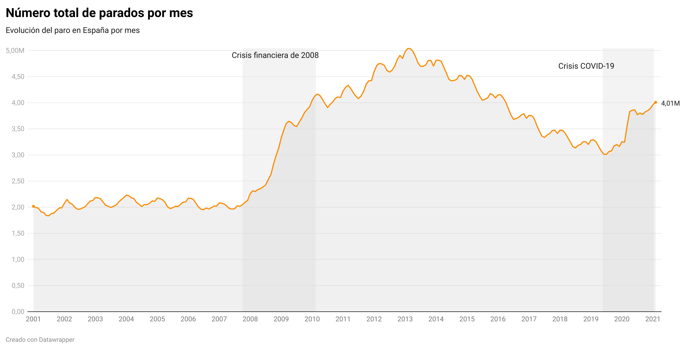

Hemos propuesto este recorrido para construir esta web: 

- Escribe el texto en `nano`. 
- Utiliza sintaxis _Markdown_.
- Una vez que tengas el texto, copia el _Markdown_ en la página de prueba de [Pandoc](https://pandoc.org/try) y conviértelo desde ese menú (_parse_) a HTML. 
- Copia ese _HTML_ y pégalo en el código de esta parte del contenido. 

-------------------------

##Aquí insertamos nuestro iframe

<iframe title="Número total de parados por mes" aria-label="Interactive line chart" id="datawrapper-chart-FXf9Q" src="https://datawrapper.dwcdn.net/FXf9Q/1/" scrolling="no" frameborder="0" style="width: 0; min-width: 100% !important; border: none;" height="400"></iframe>

Lorem ipsum dolor sit amet, consectetur adipiscing elit. Etiam id accumsan felis. Suspendisse aliquet interdum erat, dictum cursus mauris tincidunt vel. In hac habitasse platea dictumst. Curabitur scelerisque sagittis libero, aliquam tristique ante viverra id. Sed eleifend tincidunt nibh, vel suscipit turpis interdum feugiat. Donec quis nunc eu augue eleifend maximus. Aenean elit leo, ultricies ac ornare quis, vestibulum vitae libero. 

-------------------------

## Aquí insertamos una imagen 

